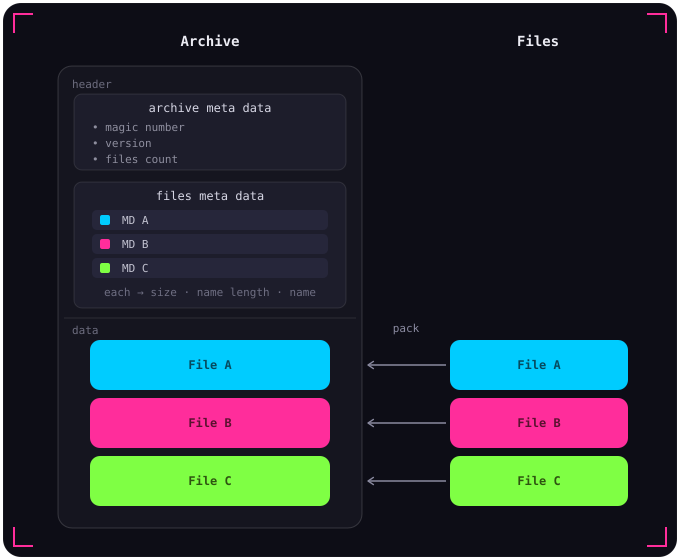

# PA File Format

  

## Archive Header

| Field         | Type    | Size    | Description                    |
| ------------- | ------- | ------- | ------------------------------ |
| `signature`   | `int`   | 4 bytes | Magic number: `0xFFEFFE`       |
| `version`     | `float` | 4 bytes | Format version                 |
| `files_count` | `int`   | 4 bytes | Number of files in the archive |

---

## File Metadata Table Header

| Field         | Type     | Size                | Description                    |
| ------------- | -------- | ------------------- | ------------------------------ |
| `size`        | `size_t` | 8 bytes             | Size of the raw data file      |
| `name_length` | `int`    | 4 bytes             | Length of the file name string |
| `name`        | `char[]` | `name_length` bytes | File name                      |

---

## File Data

Raw bytes of each file stored in the same order as the metadata table.
